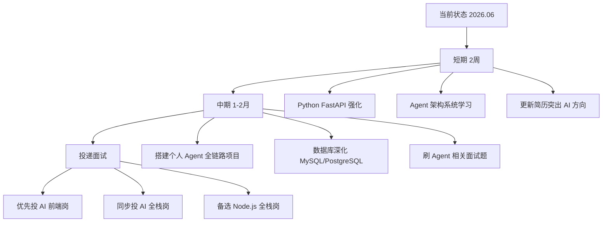

# 上海全栈 & AI 方向岗位市场分析报告

> 数据来源：猎聘（BOSS 直聘需登录才能查看详情）  
> 日期：2026-06-18  
> 目标城市：上海  
> 分析对象：王超伟 — 8 年 Web 研发经验，偏前端 + Node.js + 云原生 + AI 应用层

---

## 一、市场薪资概览

| 方向 | 薪资范围 | 典型中位数 | 代表公司 |
|------|---------|-----------|---------|
| 通用全栈工程师 | 30-55k·15薪 | ~40k | 药明生物、远景科技、西门子医疗 |
| AI Agent 全栈 | 30-60k（部分达 80k） | ~45k | 天仪智科、AI 创业公司、美的 |
| AI 前端工程师 | 25-60k | ~35-40k | MiniMax、小红书、蚂蚁 |
| 前端 AI Agent | 30-60k·16薪 | ~40k | 美团系、拼多多系社区技术方向 |

---

## 二、典型 JD 技能要求提炼

从猎聘抓取了 8 个典型 JD（4 个全栈方向 + 4 个 AI 前端方向）。

### 2.1 全栈方向

**代表 JD**：药明生物（30-55k·15薪）、天仪智科（30-40k）、AI平台全栈（30-50k）、Agent全栈（40-50k·15薪）

| 技能维度 | 高频要求 |
|---------|---------|
| **前端** | React / Vue / Angular, TypeScript, 组件化, 状态管理, 性能优化, 响应式 |
| **后端语言** | **Java + Spring Boot**（最优先）、Python (FastAPI/Django)、Go、Rust、Node.js |
| **数据库** | MySQL / PostgreSQL（建模+优化+事务）、MongoDB、Redis、Elasticsearch |
| **API** | RESTful API, GraphQL, 微服务架构 |
| **DevOps** | Docker, Kubernetes, CI/CD, Git, Linux, 监控日志 |
| **AI 能力** | LLM API 集成 (OpenAI/Anthropic/DeepSeek), RAG, Tool Calling, Agent 架构, MCP |
| **工程化** | Monorepo, Vite/Turbopack, 灰度发布, 可观测性 |
| **软技能** | Owner意识、产品思维、跨团队协作、独立推进 0→1 |

**关键 JD 摘录**：

> 天仪智科（AI Agent 平台，30-40k）：熟悉 Rust / TypeScript / Node.js 等多种语言，有前端（React / Next.js）开发经验；有 Electron 桌面端开发经验；熟悉 AI Agent / 大模型应用开发，了解 Agent loop、Tool Use、MCP、Prompt 工程。

> AI 工程平台（30-50k）：后端深度掌握 Python 或 Rust，熟练使用 FastAPI；前端深度掌握 React、TypeScript、Vite；熟悉大模型 API 集成，理解 RAG、Tool Calling 核心概念；熟悉 Docker/K8s。

> Agent 全栈（40-50k·15薪）：深度使用各类 AI 工具（Claude Code、Codex、Cursor 等），已形成稳定的 AI-first 工作方式；了解 Skills 和 Memory 的工作原理；熟练理解 SDD 等 vibe coding 原理。

### 2.2 AI 前端 / AI Agent 方向

**代表 JD**：MiniMax（40-60k）、AI前端开发（30-60k）、前端AI Agent（30-60k·16薪）、AIGC前端（25-40k·13薪）

| 技能维度 | 高频要求 |
|---------|---------|
| **前端基础** | React / Vue / Next.js, TypeScript, WebGL / Canvas 加分 |
| **AI Agent 开发** | **Agent架构模式**（ReAct, Plan-and-Execute, Multi-Agent）, Prompt Engineering, Function Calling / Tool Use |
| **AI 工具链** | Cursor / Claude Code / Copilot 深度使用, Skills + Memory 机制, MCP Server 搭建 |
| **RAG 系统** | 文档切分、Embedding 选型、向量检索、质量优化 |
| **LLM 工程** | Streaming 处理、Context Window 管理、Token 成本优化 |
| **全栈能力** | Node.js, Python/Go, MySQL/Redis, 不设边界 |
| **Eval 体系** | Agent 效果评估、评测指标、测试用例设计 |

**关键 JD 摘录**：

> 前端 AI Agent 工程师（30-60k·16薪）：深度使用 AI 工具驱动日常开发，将 AI 融入需求分析、方案设计、编码实现、调试排查、Code Review 等研发全流程；独立设计、开发和迭代 AI Agent；扎实的 Prompt Engineering 能力，掌握 System Prompt 设计、Few-shot、CoT、结构化输出等技巧；深入理解 Function Calling/Tool Use 机制；熟悉 Agent 架构模式（ReAct、Plan-and-Execute、Multi-Agent）。

> MiniMax AI 前端（40-60k）：负责 Agent 相关 Web/桌面端产品的前端研发；参与 AI Agent 交互体验、工作流界面、多模态内容展示等核心模块建设；对 AI Agent、AI 工具、AI 应用有兴趣。

---

## 三、平台投递策略补充

### 3.1 BOSS直聘 vs 猎聘差异

| 平台 | 特点 | 投递建议 |
|------|------|---------|
| **猎聘** | 中高端岗位多，大厂多，JD描述规范 | 精投10-15个匹配度高的岗位（AI全栈、Agent全栈），投大厂、知名AI公司首选 |
| **BOSS直聘** | 创业公司多，反馈快，薪资跨度大 | 广撒网30-50个，主动发起沟通，用Electron + AI经验作为钩子吸引注意 |

### 3.2 Java优先级调整说明

> 原报告将Java + Spring Boot列为🔴高优先级，基于赛道聚焦原则调整建议：

- **核心赛道是AI方向**，不是传统企业应用开发。AI创业公司（天仪智科、MiniMax等）主要使用 Python + TypeScript/Node.js 技术栈
- Java是药明生物这类传统大厂的偏好，如果主要投AI公司，Java不是刚需
- 时间宝贵，应把 **Python + Agent 全链路** 放在绝对优先位置，Java可作为后续拓展方向

---

## 四、个人能力画像 vs 市场需求

### 4.1 个人技能盘点

| 层级 | 技能 | 熟练度 | 年限 |
|------|------|--------|------|
| 前端核心 | React, TypeScript, Umi, Ant Design, webpack | 精通 | 8年 |
| 微前端 | qiankun 开放平台, 插件体系, 运行时 API | 精通 | 3年+ |
| 跨端 | Electron, NW.js, IPC 通信, Native 容器 | 熟练 | 3年+ |
| Node 服务端 | Nest.js, Next.js, OAuth2.0/SSO, BFF | 熟练 | 3年+ |
| 云原生 | Docker, K8s, Helm, Nginx, Ingress | 熟悉 | 2年+ |
| AI 前端 | RAG 知识助手, 流式 Markdown, Mermaid/KaTeX | 有落地经验 | 1年+ |
| AI 工具链 | Cursor, Claude Code, Codex, AI 工作流 | 深度使用 | 1年+ |
| 传统后端 | PHP + MySQL | 约1年（早期） | 1年 |
| 团队管理 | Tech Owner, 方案评审, 代码评审, 指导实习生 | 有实战 | 2年+ |

### 4.2 核心优势（竞争力强）

| 你的能力 | 市场匹配度 | 说明 |
|---------|-----------|------|
| **React/TypeScript 8年深耕** | ⭐⭐⭐⭐⭐ | 所有 JD 的核心要求，微前端+开放平台经验远超普通前端 |
| **Node.js BFF (Nest.js/Next.js)** | ⭐⭐⭐⭐ | 全栈方向 Node.js 技术栈完全匹配 |
| **Electron 跨端开发** | ⭐⭐⭐⭐⭐ | **稀缺技能！** 天仪智科等 JD 明确要求，能让你在候选人中脱颖而出 |
| **AI 前端落地（RAG 助手）** | ⭐⭐⭐⭐ | 流式 Markdown、Mermaid/KaTeX 渲染 → 直接匹配 AI 前端 JD |
| **AI 编码工具深度使用** | ⭐⭐⭐⭐⭐ | Cursor/Claude Code/Codex → 前端 AI Agent JD 的**核心要求** |
| **云原生 (Docker/K8s/Helm)** | ⭐⭐⭐⭐ | 大部分 JD 要求，你有私有化部署实战经验 |
| **微前端架构 (qiankun)** | ⭐⭐⭐⭐ | 体现架构能力，中大型企业看重 |
| **团队管理 + Tech Owner** | ⭐⭐⭐⭐ | 牵头方案设计、代码评审、指导实习生 → 高级/资深岗加分 |
| **ToB 私有化经验** | ⭐⭐⭐ | 药明生物等企业级公司看重 |
| **前后端一体化交付** | ⭐⭐⭐⭐ | 从页面交互→BFF→部署→排查全链路覆盖 |

### 4.3 需要补充的能力

| 缺口 | 紧迫度 | 市场依据 | 建议 |
|------|--------|---------|------|
| **Java + Spring Boot** | 🟡 中 | 药明生物等大厂 JD 明确优先 Java | 赛道聚焦AI则优先级降低，传统企业方向可补 |
| **Python 后端 (FastAPI)** | 🔴 高 | AI 方向几乎必问，LangChain/LlamaIndex 生态全在 Python | 从"参与维护"升级到**独立开发 RAG 后端服务** |
| **Python 后端 (FastAPI)** | 🔴 高 | AI 方向几乎必问，LangChain/LlamaIndex 生态全在 Python | 从"参与维护"升级到独立开发 RAG 后端服务 |
| **数据库深度** | 🟡 中高 | JD 要求数据库建模、索引优化、SQL 调优、事务管理 | 补 MySQL 深度 + 了解 PostgreSQL / Redis |
| **AI Agent 核心架构** | 🟡 中高 | Agent 全栈/前端 Agent JD 均要求 ReAct、Tool Calling、MCP | 从 RAG 前端渲染层拓展到 Agent 全链路自建 |
| **Prompt Engineering** | 🟡 中 | System Prompt 设计、Few-shot、CoT、结构化输出 | 需要系统学习 + 实践，前端 Agent JD 明确要求 |
| **消息队列/中间件** | 🟢 中低 | Kafka/RabbitMQ 在部分 JD 中出现 | 了解基本概念和使用场景 |
| **Rust / Go** | 🟢 低 | 部分 AI 创业公司 JD 提到，不是主流要求 | 作为加分项，不急 |

---

---

## 五、面试高频考点预判

### 5.1 AI方向必问

```
🔹 RAG相关：
   - 文档切分策略有哪些？怎么处理长文档？
   - Embedding模型怎么选？有哪些优化手段？
   - 检索召回率低怎么办？重排策略了解吗？

🔹 Agent相关：
   - ReAct模式的工作原理？
   - Tool Calling 怎么保证稳定性？
   - 多Agent协作有哪些架构模式？

🔹 工程化相关：
   - Streaming输出怎么处理中断/重连？
   - Token成本怎么优化？
   - Context Window超限怎么处理？
```

### 5.2 全栈必问

```
🔹 数据库：
   - MySQL索引原理？B+树 vs B树？
   - 事务隔离级别？各自解决什么问题？
   - Redis缓存穿透、击穿、雪崩的区别和解决方案？

🔹 Node.js：
   - 事件循环机制？
   - 内存泄漏排查经验？
   - 进程管理（PM2、cluster）？
```

### 5.3 「杀手锏项目」设计建议

**项目名称：企业级私有知识助手（对标RAG经验，升级为全栈）**

| 维度 | 技术选型 | 说明 |
|------|---------|------|
| 前端 | React + TypeScript + Vite | 复用现有流式Markdown渲染能力 |
| 后端 | Python + FastAPI + LangChain | AI方向标准技术栈 |
| 向量库 | Chroma / Milvus | 本地可运行，面试可演示 |
| 部署 | Docker + Docker Compose | 体现云原生能力 |

**核心功能（体现深度）：**
- ✅ 文档上传与解析（PDF/Word/Markdown）
- ✅ 智能切分 + 语义检索
- ✅ 多轮对话 + 引用溯源
- ✅ Prompt模板管理
- ✅ 对话历史持久化
- ✅ 简易评测面板（BLEU/ROUGE分数）

**为什么有效**：把已有的"AI前端经验"升级为"AI全栈经验"，面试时可以现场演示，说服力远超简历文字，直接对标天仪智科、MiniMax等公司的JD要求。

---

## 六、两个方向的定位与策略

### 6.1 🅰️ 方向一：AI 全栈工程师（推荐优先）

**目标薪资：35-50k·15薪**

**定位表述**：

> 以前端为底座、Node.js 为桥梁、AI Agent 为增长点的全栈工程师。8 年 React/TypeScript 深耕 + Electron 跨端 + AI 应用层落地 + 云原生部署，具备从 AI 交互界面到 Agent 服务端到容器化交付的端到端能力。

**匹配度自评**：

| JD 要求 | 你的现状 | 差距 |
|---------|---------|------|
| React/TS 前端 | 精通 ✓ | 无 |
| Node.js 后端 | 熟练 ✓ | 无 |
| AI Agent 开发 | 有前端落地经验，缺少自建 Agent 全链路 | 需要补 |
| Python 后端 | 仅参与维护 | 需要补 |
| 数据库 | PHP+MySQL 浅层经验 | 需要补 |
| Docker/K8s | 有实战 ✓ | 无 |

**现有简历可以直接投的方向**：
- AI 前端工程师（匹配度最高，薪资 25-60k）
- 前端 AI Agent 工程师（你的 AI 工具链经验是核心卖点）
- Node.js 全栈工程师（Nest.js/Next.js BFF 经验匹配）

### 6.2 🅱️ 方向二：通用全栈工程师

**目标薪资：30-45k**

**定位表述**：

> 前端深厚 + Node.js 全栈 + 云原生 + ToB 经验的全栈工程师。具备从 Web/H5/桌面客户端前端到 Node.js BFF 聚合层到 Docker/K8s 私有化部署的完整交付能力。

**匹配度自评**：

| JD 要求 | 你的现状 | 差距 |
|---------|---------|------|
| 前端 | 精通 ✓ | 无 |
| Java Spring Boot | 无 | 🔴 需要补 |
| Python | 浅 | 🟡 需要补 |
| 数据库 | 浅 | 🟡 需要补 |
| 微服务 | Node.js BFF 有相关经验 | 🟢 概念可迁移 |

**这个方向的挑战更大**，因为通用全栈 JD（如药明生物）明确偏好 Java。但如果目标公司恰好用 Node.js 技术栈（如天仪智科），匹配度就非常高。

---

---

## 七、简历优化措辞建议

**优化原则**：把"做了什么"升级为"做成了什么"，用量化成果体现价值。

| 原描述 | 优化后描述 |
|--------|-----------|
| 熟悉大模型 Chatbox 前端业务，具备流式 Markdown、Mermaid、数学公式渲染... | 主导企业级 RAG 知识助手前端架构设计与落地，实现流式 Markdown 渲染引擎，支持代码高亮、Mermaid 图表、LaTeX 公式等复杂结构化内容展示。针对流式输出性能优化，采用增量渲染策略，长文首屏渲染速度提升 40%。支撑 Web、H5、WPS 插件三端落地。 |
| 熟练使用 Cursor、Codex、Claude Code 等 AI 编码工具 | 深度使用 Cursor、Claude Code 等 AI 编码工具，构建 AGENT.md + 项目知识库 + 研发工作流的 AI-first 研发体系，落地于复杂历史项目的代码理解、问题定位、重构和文档生成，研发效率提升 30%。 |
| 熟悉 Docker、Kubernetes、Helm、Nginx、Ingress 等云原生技术 | 具备 ToB 私有化部署实战经验，熟练使用 Docker、K8s、Helm 进行镜像管理、容器编排和问题排查，支撑企业级产品在复杂客户环境下的稳定交付。 |

---

## 八、行动计划



### 8.1 具体行动项

#### 第 1 周
- [ ] 用 Python FastAPI + LangChain 搭建一个简单的 RAG 问答后端（对接已有的前端渲染能力），形成完整闭环
- [ ] 系统学习 Prompt Engineering：System Prompt 设计、Few-shot、CoT、结构化输出

#### 第 2 周
- [ ] 学习 Agent 核心概念（ReAct / Tool Calling / MCP），基于 Claude API 搭建一个可用的 Agent Demo
- [ ] 更新简历：突出 AI 方向经验，弱化纯前端色彩

#### 第 3-4 周
- [ ] 将 Agent Demo 产品化（加前端界面、Eval 评测、Prompt 管理），成为简历上最强的 AI 项目
- [ ] MySQL 深化：索引优化、慢查询分析、事务隔离级别

#### 第 5-8 周
- [ ] 约面试，以 AI 前端工程师岗位练手（匹配度最高，通过率最高）
- [ ] 根据面试反馈迭代简历和 Agent 项目
- [ ] 同步投递 AI 全栈岗位

---

---

## 九、总结

| 维度 | 评估 |
|------|------|
| **最匹配岗位** | AI 前端工程师 / 前端 AI Agent 工程师 |
| **可冲刺岗位** | AI 全栈工程师 / Agent 全栈工程师 |
| **核心竞争力** | React 深度 + Electron + AI 前端落地 + AI 工具链 + 微前端架构 + 云原生 |
| **关键短板** | Python 后端深度、数据库深度、Agent 全链路自建项目经验 |
| **建议优先补** | Python + FastAPI + LangChain + Agent 开发 → 打开 AI 全栈大门 |
| **预期薪资** | 保守 35-45k，冲一冲可达 50-60k |
| **所需时间** | 1-2 个月完成跃迁 |

**一句话总结**：你的前端底座非常扎实，AI 方向的门已经打开了。现在只需要补上 **Python 后端 + Agent 全链路自建能力**，就能从"AI 前端消费者"跃升为"AI 全链路构建者"。别纠结 Java，把 Python + Agent 做扎实，用一个完整的全栈 AI 项目把简历上的"熟悉"变成"精通"，然后大胆投！

---

---

## 附录 A：猎聘 JD 原始数据索引

| # | 岗位名称 | 公司/类型 | 薪资 | 关键要求 |
|---|---------|----------|------|---------|
| 1 | 全栈工程师 | 药明生物 | 30-55k·15薪 | Java优先、React、MySQL、Docker/K8s |
| 2 | 全栈工程师 | 天仪智科 | 30-40k | Rust/TS/Node.js、Electron、AI Agent、MCP |
| 3 | 全栈工程师（AI工程&平台） | 新能源AI公司 | 30-50k | Python/Rust、React、FastAPI、LLM、Docker |
| 4 | Agent全栈工程师 | AI创业公司 | 40-50k·15薪 | AI Agent、Claude Code/Cursor、Skills/Memory |
| 5 | AI前端工程师 | AIGC文化公司 | 25-40k·13薪 | React/Next.js、WebGL、AIGC交互 |
| 6 | AI前端开发 | 计算机软件公司 | 30-60k | React、Python/Go、MySQL/Redis、AIGC |
| 7 | 前端AI Agent工程师 | 互联网大厂 | 30-60k·16薪 | Agent开发、Prompt工程、Tool Calling、MCP |
| 8 | AI前端工程师 | MiniMax | 40-60k | AI Agent交互、工作流界面、多模态 |

## 附录 B：技术栈热度词云

```
React TypeScript Node.js Python Docker Kubernetes
AI Agent LLM MCP RAG Prompt Engineering
Electron Next.js Nest.js Spring Boot FastAPI
MySQL PostgreSQL Redis MongoDB
Vite webpack Monorepo CI/CD
ReAct Tool Calling Streaming Eval
```
